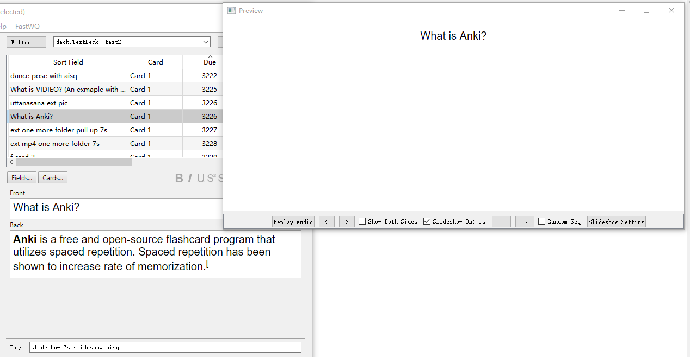
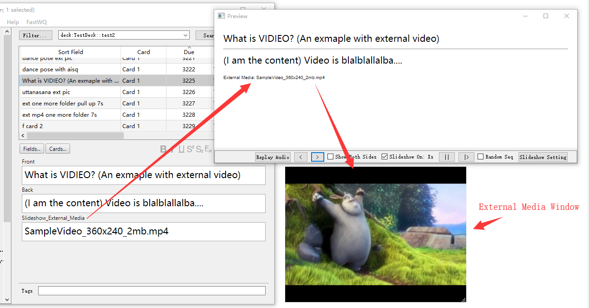

# anki-preview-slideshow

- The ability to translate the add-on into your own language has been added to the "Language" setting in the settings.

- The ability to keep the card viewer window on top of all other windows in the system has been added to the "WindowStaysOnTop" setting in the settings.

- Improved MPlayer functionality (rewind, playback). However, this is probably no longer needed by many.

- The most important feature is the ability to view cards without switching to the "Overview" window and the ability to immediately mark them (for example, you can mark cards in red that will later be added to a filtered deck for replay). When randomly selecting a card, you can return to the same position from the table in the "Overview" window. This is a simple history of positions (not cards!), so if you change the sorting in the card table, the positions will no longer be correct. If you select cards randomly, the risk of accidentally ending up in the same index from the table is minimized. And various other improvements, some visible, others not.
  

Previous edits by: [https://ankiweb.net/shared/info/1621302762](https://ankiweb.net/shared/info/1621302762)

The original addon, where you can find out more about it: [https://ankiweb.net/shared/info/90397199](https://ankiweb.net/shared/info/90397199)

**What is this for?**

I had some free time around New Year's, so I started looking for an addon to use to redesign the preview window. I chose "Preview Slideshow (Fixed by Shige)." But in its current form, it wasn't suitable at all. I had to think about how to redesign it. While I was pondering this, I also had to redesign another addon and improve its performance: [Advanced Browser - mod kaiu 2026](https://ankiweb.net/shared/info/1334324384). So time dragged on, and March had already arrived :(

This addon is recommended for use with the [Advanced Browser - mod kaiu 2026](https://ankiweb.net/shared/info/1334324384) addon.

The purpose of this addon is to allow you to view cards selected in a table; to immediately mark cards you need from the table view (for example, if they are difficult for you, you can use a flag); to randomly select cards; when you need to assess how much you know (remember) a particular deck, you only need to view 5% of the cards in the deck and decide what to do; to view cards only in the order you want (someone really wants this), simply create a new field, say named "Np" and enter numbers (or text) by which you can then sort this field (see the "Advanced Browser - mod kaiu 2026" addon).

**Added since version 0.9.5, date: 2026-07-03**

Fixed loss of focus when checking a checkbox or marker if the window was not on top of all other windows in the system.

Added a button with the image "1234" ("Grade Now..."). This standard algorithm can be accessed using the hotkey "Ctrl+Shift+G."
You can also use hotkeys to set a "Set Due Date...": "Ctrl+Shift+D" and "Reset...": "Ctrl+Alt+N". Added some information to the header display to make it clear what is changing in "Due".

#### HELP AND SUPPORT

**Please do not use reviews for bug reports or support requests.** 
**And be sure to like,** as your support is always needed. Thank you.
I don't get notified of your reviews, and properly troubleshooting an issue through them is nearly impossible. Instead, please either use the [issue tracker (preferred),](https://github.com/AndreyKaiu/Preview-Slideshow-Shigeyuki---mod-kaiu-2026/issues) , or just message me at [andreykaiu@gmail.com.](mailto:andreykaiu@gmail.com) Constructive feedback and suggestions are always welcome!

#### VERSIONS
- 0.9.6, date: 2026-09-04. Fixed "Grade Now..." function for version 25. Fixed a bug in Anki logic: if the user does not specifically include the "{{FrontSide}}" field in the card's back design, then the front side sound does not need to be played. 
- 0.9.5, date: 2026-07-03. Added a button with the image "1234" ("Grade Now...") +"Ctrl+Shift+D" +  "Ctrl+Alt+N"
- 0.9.4, date: 2026-06-07. More stable display has been made for Anki version 2026_b2. Removed logging, as it froze during an update (if necessary, remove this addon and reinstall it, number 1188253433)
- 0.9.3, date: 2026-06-06.  Forgotten frame near the button.
- 0.9.2, date: 2026-05-12.  Fixed the appearance of buttons under dark and light themes.
- 0.9.1, date: 2026-03-01. 

=========================

**See my other addons and decks here:** [https://ankiweb.net/shared/by-author/1188253433](https://ankiweb.net/shared/by-author/1188253433) 

=========================

**Make Anki preview window as slideshow. For each card, it also introduce a media window to show external media files(not stored in Anki DB) like mp4, mp3, jpg, etc. External media window can be disabled, of course.**

## Quick Start Guide (Deprecated for version 0.9):
0. Installation: https://ankiweb.net/shared/info/90397199
1. Click "Browse" -> on Browser window, select target deck or filter out desired cards
2. Click "Preview" to open preview slideshow window
3. Click "Slideshow on/off" to check the box and start slideshow

* If mplayer is not availabe in your anki, you will need to install it if you'd like to play video in external window.

## Instructions:

1. Check/Uncheck "Slideshow On/Off" to start/stop slideshow
2. Check/Uncheck "Random Seq" to activate/disable random sequence
3. Click "||" button to pause slideshow
4. Click "|>" button to continue slideshow or go to next slide
5. Use tag like "slideshow_Xs" to indicate showing answer for X seconds
   (no time tag for question)
   for example, "slideshow_17s" for 17 seconds
6. Use tag like "slideshow_audio_replays_X" to indicate replay audio X times before going to next slide
   (no audio replay tag for question)
   for example, "slideshow_audio_replays_17" for replay 17 times
7. Use tag "slideshow_aisq" to indicate question slide is same with answer slide and answer slide should be skipped.
8. To show external media like mp4, jpg, gif.
   a. Create a field in exact name "Slideshow_External_Media"
   b. Put the file path for the external media file there like "D:/somefolder/myvideo.mp4"
   c. Root forder can also be set in settings. Like setting it to "D:/somefolder"
      then "Slideshow_External_Media" field can work in relative path like "myvideo.mp4", "sometype/blabla.png"
   d. With root folder set, if you want to use absolute path accassion occasionally,
      put "$$" before the path, like "$$D:/somefolder/myvideo.mp4"
9. A trick: to align buttons in preview window left, open preview window, resize it to a very small one, reopen it
10. Hover over buttons to see tooltips
11. Right click on the toolbox in preview window, or the external media window, to access functions.

## Source Code

1. Source code can be found on https://github.com/tosimplicity/anki-preview-slideshow
2. This add-on is licensed under GPL v3, or higher

## Version History

Version 0.8
- compatible with anki 2.1.45+

Version 0.7
- activate Relate to My Doc plugin if available

Version 0.6
- replays audio according to tag

Version 0.5
- adapt to anki version 2.1.41+

Version 0.4
- use set interval when mplayer is not available.

Version 0.3
- fix bug in logging for Anki version between 2.1.20 and 2.1.23

Version 0.2
- Make it compatible with Anki 2.1.24+
- add absolute path marker support while root folder set

Version 0.1
- Initial release
